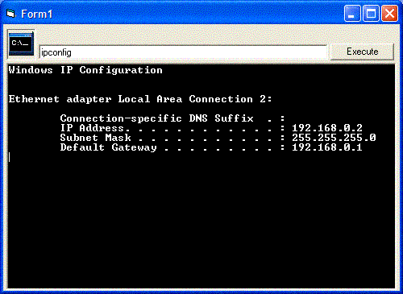

## Easy Dos Control: Execute Dos Command & Capture Result

### Description

This is a very easy to use control. Example Code: 'Text2.Text = Text2.Text & DOS1.ExecuteCommand(Text1.Text)'. Thats all you have to do. You execute the command and it captures the result. Tell me how you like or what i need to do to make it better.
 
### More Info
 

             |
---                |---
**Submitted On**   |2004-02-03 14:21:22
**By**             |[Eric Wolcott](https://github.com/Planet-Source-Code/PSCIndex/blob/master/ByAuthor/eric-wolcott.md)
**Level**          |Intermediate
**User Rating**    |4.8 (57 globes from 12 users)
**Compatibility**  |VB 3\.0, VB 4\.0 \(16\-bit\), VB 4\.0 \(32\-bit\), VB 5\.0, VB 6\.0
**Category**       |[Custom Controls/ Forms/  Menus](https://github.com/Planet-Source-Code/PSCIndex/blob/master/ByCategory/custom-controls-forms-menus__1-4.md)
**World**          |[Visual Basic](https://github.com/Planet-Source-Code/PSCIndex/blob/master/ByWorld/visual-basic.md)
**Archive File**   |[Easy\_Dos\_C170355232004\.zip](https://github.com/Planet-Source-Code/eric-wolcott-easy-dos-control-execute-dos-command-capture-result__1-51457/archive/master.zip)

